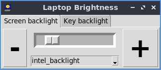
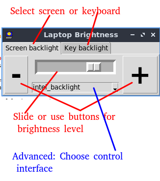
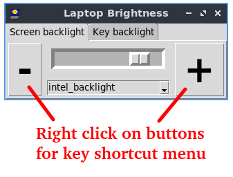
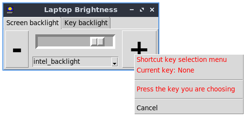
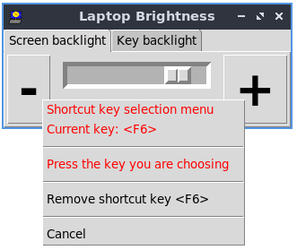

# backlighter
Linux laptop screen and kepboard brightness control

By Paul H Alfille 2021
MIT license

# Summary
Simple controls for some laptop backlight and keyboard lights under linux


# Background

## Pixel 2013
Inspiration was a repurposed Google Chromebook Pixel 2013

See [pixel2013](https://github.com/alfille/pixel2013) for the full story.

This program addresses screen and keyboard brightness for a number of devices where that capability is exposed in the `/sys/class/` virtual file system

## Backlighter
* This [project](https://github.com/alfille/backlighter) is a fork of the pixel2013
  * Still supports the Google Pixel Chromebook 2013 version
  * Development work done here
  * Any improvements here will be back-ported

# Install
* Download source `git clone http://github.com/alfille/backlighter`
* Compile `make all`
* Install `sudo make install`
* This wil; install
  * command line tools
  * graphics tools
  * menu entry 	
* Full script:

```
git clone http://github.com/alfille/backlighter
cd backlighter
make all
sudo make install
```
* The following python3 modules are required (but fortunately are part of the standard distribution)
  * sys
  * signal
  * tkinter tkinter.ttk tkinter.font
  * pathlib.Path

# Usage
## command line tool
`brightness [-b|-k] number` -- in percent

```
brightness -- set the screen or keyboard brightness level for the Google Pixel Chromebook (2013)

Writes to /sys/class -- needs root privileges
by Paul H Alfille 2021

	brightness -b -- show backlight percent
	brightness -b 43-- set backlight percent

	brightness -k -- show keylight percent
	brightness -k 43-- set keylight percent

	brightness -b (screen backlight) is assumed if k or b not specified

	brightness -h -- this help
```
## graphical tool



* Program name is backlighter
  * installed in /usr/bin
  * setsuid (i.e. root privileges)
  * calls python3 program `pybacklight.py` in turn
* `pybacklight.py` is the actual program displayed 
  * For problems, run `sudo python3 ./pybacklight.py` from a terminal to see error output
  * python3 program with tkinter graphics so should need very few additional libraries
* Desktop icon and menu support
  * backlighter.desktop is included
  * menu entry should be added automatically if window manager supports OpenDesktop protocols
* Controls for graphical application: key 

* Setting shortcut keys for brightness levels
  * Shortcut works when mouse hovers over screen
  * Open shortcut menu -- right-click "+" and "-" buttons

  * Setting shortcut when menu is open
  * Click chosen key while hovering over menu
  
  * Clear key from same menu


## Security
The controls require root access and so are setsuid programs (which is a possible security risk), but allow very circumscribed and sanitized input.

Uses the controls are exposed by the operating system in a virtual filesystem:
> * /sys/class/backlight/xxxxx/backlight
> * /sys/class/leds/xxxxx/backlight

